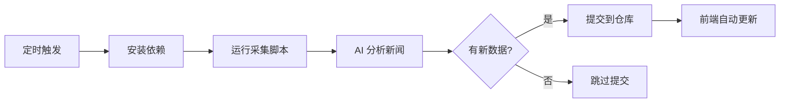

# GitHub Actions 自动化采集配置指南

## ✅ 已完成的配置

GitHub Actions 工作流已创建：`.github/workflows/scheduled-collect.yml`

### 📅 定时执行计划

- **早上 10:00**（北京时间）- 采集上午重要新闻
- **晚上 22:00**（北京时间）- 采集全天重要新闻

### 🔧 需要配置的 GitHub Secrets

在 GitHub 仓库中设置以下 Secrets：

1. 进入仓库 → **Settings** → **Secrets and variables** → **Actions**
2. 点击 **New repository secret**
3. 添加以下密钥：

| Secret 名称 | 说明 | 必需 |
|------------|------|------|
| `OPENAI_API_KEY` | OpenAI 兼容 API 密钥（如 DeepSeek） | ✅ 必需 |
| `AI_API_ENDPOINT` | API 端点（默认：OpenAI） | 可选 |
| `AI_MODEL` | 模型名称（默认：gpt-4o-mini） | 可选 |

### 📝 配置示例

如果使用 DeepSeek：
```
OPENAI_API_KEY: sk-xxxxxxxxxxxxx
AI_API_ENDPOINT: https://api.deepseek.com/v1/chat/completions
AI_MODEL: deepseek-chat
```

## 🚀 使用方式

### 自动执行
- 配置完成后，GitHub Actions 会自动在每天 10:00 和 22:00 执行
- 采集到新闻后会自动提交到仓库
- 前端会自动使用最新数据（ISR 5分钟刷新）

### 手动触发
1. 进入仓库 → **Actions** 标签
2. 选择 **Scheduled News Collection** 工作流
3. 点击 **Run workflow** → **Run workflow**
4. 等待执行完成

## 📊 工作流程



## 🔍 监控执行

### 查看执行日志
1. 进入仓库 → **Actions** 标签
2. 查看最近的工作流执行记录
3. 点击查看详细日志

### 执行结果通知
- ✅ 成功：新数据已提交到仓库
- 📋 无更新：没有新的新闻数据
- ❌ 失败：检查日志查看错误信息

## ⚙️ 高级配置

### 修改执行时间

编辑 `.github/workflows/scheduled-collect.yml`：

```yaml
schedule:
  # 自定义时间（使用 UTC 时间）
  # 北京时间 = UTC + 8
  - cron: '0 2 * * *'   # 北京时间 10:00
  - cron: '0 14 * * *'  # 北京时间 22:00
```

### 添加更多时段

```yaml
schedule:
  - cron: '0 2 * * *'   # 早上 10:00
  - cron: '0 6 * * *'   # 下午 14:00
  - cron: '0 14 * * *'  # 晚上 22:00
```

### Cron 表达式说明

格式：`分钟 小时 日 月 星期`

示例：
- `0 2 * * *` - 每天 UTC 2:00（北京 10:00）
- `*/30 * * * *` - 每 30 分钟
- `0 */6 * * *` - 每 6 小时

## 🛠️ 故障排查

### 问题：工作流没有执行
- 检查是否配置了必需的 Secrets
- 确认仓库的 Actions 权限已启用
- 查看 Actions 标签页的执行记录

### 问题：API 调用失败
- 检查 `OPENAI_API_KEY` 是否正确
- 确认 API 额度是否充足
- 查看执行日志中的错误信息

### 问题：提交失败
- 确认 GitHub Actions 有写入权限
- 检查 `GITHUB_TOKEN` 权限设置

## 📦 本地测试

在推送到 GitHub 之前，可以本地测试：

```bash
# 设置环境变量
export OPENAI_API_KEY="your-api-key"
export AI_API_ENDPOINT="your-api-endpoint"
export AI_MODEL="your-model"

# 运行采集脚本
node scripts/scheduledCollect.js
```

## 🔒 安全提示

- ✅ 使用 GitHub Secrets 存储敏感信息
- ✅ 不要在代码中硬编码 API 密钥
- ✅ 定期轮换 API 密钥
- ✅ 监控 API 使用量和成本

## 💡 优化建议

1. **成本控制**：
   - 限制每次采集的新闻数量
   - 使用更便宜的 AI 模型（如 gpt-4o-mini）
   - 设置 API 调用频率限制

2. **性能优化**：
   - 启用并行采集和分析
   - 使用批量处理减少 API 调用
   - 缓存重复的分析结果

3. **可靠性提升**：
   - 添加错误重试机制
   - 设置超时时间
   - 配置失败通知

## 📞 获取帮助

如有问题，请查看：
- [GitHub Actions 文档](https://docs.github.com/en/actions)
- [Cron 表达式生成器](https://crontab.guru/)
- 项目 Issues 页面
