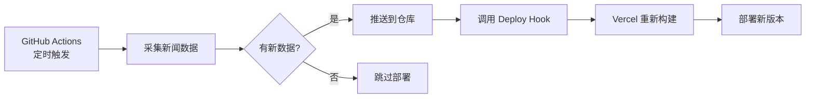

# Vercel 自动部署配置指南

当 GitHub Actions 采集到新数据并推送到仓库后，自动触发 Vercel 重新部署以更新线上数据。

## 📋 配置步骤

### 步骤 1：在 Vercel 创建 Deploy Hook

1. 打开 [Vercel Dashboard](https://vercel.com/dashboard)
2. 选择你的项目 `Perps-news`
3. 进入 **Settings** → **Git** 标签
4. 滚动到 **Deploy Hooks** 部分
5. 点击 **Create Hook** 按钮

配置如下：
```
Hook Name: Auto Deploy on News Update
Git Branch: main
```

6. 点击 **Create Hook**
7. **复制生成的 URL**（类似：`https://api.vercel.com/v1/integrations/deploy/prj_xxx/yyy`）

### 步骤 2：配置 GitHub Secret

1. 打开 GitHub 仓库：https://github.com/gunksd/Perps-news
2. 进入 **Settings** → **Secrets and variables** → **Actions**
3. 点击 **New repository secret**
4. 配置如下：
   ```
   Name: VERCEL_DEPLOY_HOOK
   Secret: [粘贴步骤1复制的 Deploy Hook URL]
   ```
5. 点击 **Add secret**

### 步骤 3：测试自动部署流程

#### 方式 1：手动触发工作流测试
1. 进入 GitHub 仓库的 **Actions** 标签
2. 选择 **Scheduled News Collection** 工作流
3. 点击 **Run workflow** → 选择 `main` 分支 → **Run workflow**
4. 等待工作流完成
5. 如果有新数据，会自动触发 Vercel 部署

#### 方式 2：等待定时任务
- 工作流会在每天 10:00 和 22:00（北京时间）自动运行
- 如果采集到新数据，会自动推送并触发 Vercel 部署

## 🔄 工作流程



## ⏱️ 数据更新时间线

1. **10:00 & 22:00** - GitHub Actions 定时采集新闻
2. **+1-2 分钟** - 数据分析和推送到仓库完成
3. **+0 秒** - 立即触发 Vercel Deploy Hook
4. **+2-3 分钟** - Vercel 构建完成
5. **+0 秒** - 新数据在线上可见

**总计：约 3-5 分钟内，新数据从采集到上线**

## 🐛 故障排查

### 问题 1：工作流运行但没有触发部署
**检查清单：**
- ✅ 确认 `VERCEL_DEPLOY_HOOK` Secret 已正确配置
- ✅ 检查 Deploy Hook URL 格式正确（应该是 `https://api.vercel.com/v1/integrations/deploy/...`）
- ✅ 查看 GitHub Actions 日志中是否有 "触发 Vercel 重新部署" 的输出

### 问题 2：Vercel 部署失败
**检查清单：**
- ✅ 查看 Vercel 部署日志是否有错误
- ✅ 确认 `data/news.json` 和 `data/analyses.json` 格式正确
- ✅ 本地运行 `npm run build` 测试构建是否成功

### 问题 3：部署成功但数据未更新
**可能原因：**
- 浏览器缓存：强制刷新页面（Ctrl+Shift+R 或 Cmd+Shift+R）
- CDN 缓存：等待 1-2 分钟让 Vercel CDN 更新
- API 缓存：页面配置了 5 分钟 ISR，最多等待 5 分钟

## 📊 监控部署状态

### GitHub Actions
查看工作流运行记录：
https://github.com/gunksd/Perps-news/actions

### Vercel Dashboard
查看部署历史：
https://vercel.com/[your-username]/perps-news/deployments

## 🔧 高级配置

### 调整部署频率
编辑 `.github/workflows/scheduled-collect.yml` 的 cron 表达式：
```yaml
schedule:
  - cron: '0 2 * * *'   # UTC 2:00 = 北京时间 10:00
  - cron: '0 14 * * *'  # UTC 14:00 = 北京时间 22:00
```

### 添加部署通知
在工作流中添加通知步骤（如 Slack、Discord、Email）：
```yaml
- name: Send notification
  if: steps.verify_diff.outputs.changed == 'true'
  run: |
    # 发送通知的命令
```

## ✅ 验证配置成功

配置完成后，可以通过以下方式验证：

1. 手动触发一次 GitHub Actions 工作流
2. 查看工作流日志，应该看到：
   ```
   🚀 触发 Vercel 重新部署...
   ✅ Vercel 部署已触发
   ```
3. 打开 Vercel Dashboard，应该看到新的部署任务
4. 等待部署完成，访问网站验证数据已更新

## 📚 相关文档

- [Vercel Deploy Hooks](https://vercel.com/docs/deployments/deploy-hooks)
- [GitHub Actions Secrets](https://docs.github.com/en/actions/security-guides/encrypted-secrets)
- [GitHub Actions Scheduled Events](https://docs.github.com/en/actions/using-workflows/events-that-trigger-workflows#schedule)
